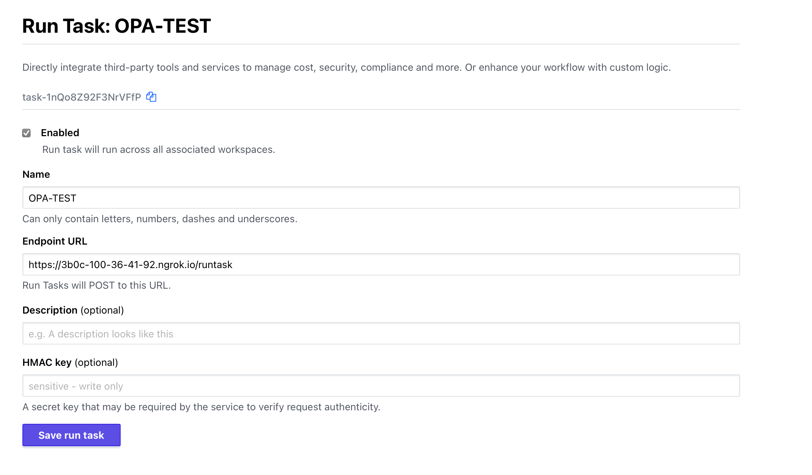

# TFC OPA RunTask Server

## Local Dev Server Setup
**This code is for POC and should not be used for production use cases.**

 Required prerequisites - Python 3, pip & OPA. 
 
 To expose the server to a public URL for integration with TFC [Run Task](https://www.terraform.io/cloud-docs/integrations/run-tasks) use a tool such as [ngrok](https://ngrok.com).

```
# Download OPA Binary
> curl -L -o opa https://openpolicyagent.org/downloads/v0.43.0/opa_darwin_amd64

#ensure OPA is executable
> chmod 755 opa
> cp opa /usr/local/bin/opa

#install prerequisites
> pip install -r requirements.txt

#start the Server
> flask --app opa-server --debug run ##debug flag auto reloads any python code changes
```

In a seperate terminal you can start ngrok using the following command

```
> ngrok http http://127.0.0.1:5000
```

The output from ngrok above shows the public forward address that will be used in TFC. it also shows a url for a local web interface that can be useful to see the data being sent from TFC to the server process via ngrok. On my machine this address is http://127.0.0.1:4040/inspect/http but may be different on yours.


Register a custom run task in Teraform Cloud. For the endpoint url use the url exposed by ngrok. 



Ensure that the runtask is assigned to a workspace

